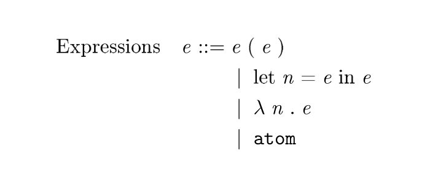

## gkd(搞快点)

alpha version, do not use.

A set of tools to help programming in LaTex.

`pip install gkd`, and append contents of `gkd.tex` to your Tex sources.

### 1. GKDBNF: The best LaTex BNF package you've ever seen?

This relies on [paperbnf](https://github.com/thautwarm/paperbnf).

**Usage**

```tex
\begin{GKDBNF}{some_unique_id}
!Expressions! <e> ::= <e> ( <e>  )
| let <n> = <e> in <e>
| !$\lambda$! <n> . <e>
| <\mathtt{atom}>

\end{GKDBNF}
```



**Remember to place a blank line in the end of GKDBNF block**.

How to write this BNF?


Follow the syntax and lexer rules:

Valid BNF Syntax:
```bnf
<atom> ::= NONTERMINAL
       | TERMINAL
       | TERMINAL2
       | '|'


<prod> ::= NONTERMINAL '::=' <atom>+ NEWLINE
       | TERMINAL NONTERMINAL '::=' <atom>+ NEWLINE
       | TERMINAL2 NONTERMINAL '::=' <atom>+ NEWLINE
       | '|' <atom>+ <NEWLINE>
```


Lexer rule by regex:
```
NEWLINE     = [\r\n]+
NONTERMINAL = <.*?>
TERMINAL2   = !.*?!
Term        = \S+
```

Whitespace tokens are ignored.


### 2. Utilities

```tex
\GKDSet{a}{1}

\GKDGet{a} % get you "1"

\GKDPush{xs}{1}
\GKDPush{xs}{2} 
\GKDPop{xs}
\GKDPop{xs} % get you "1"


\newcommand{\addone}[1]{
    \GKDPyCall{"lambda x: int(x) + 1"}{#1}
}
\addone{2}   % 3
\addone{2.0} % 3.0
```
